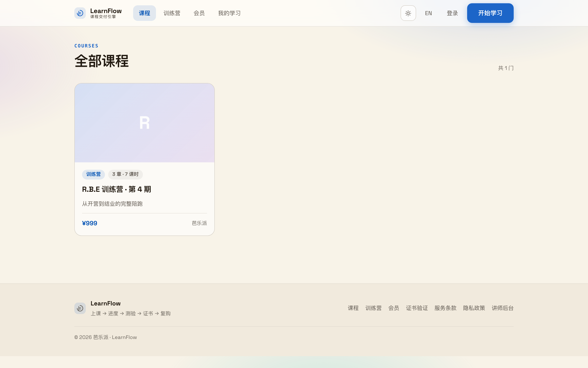
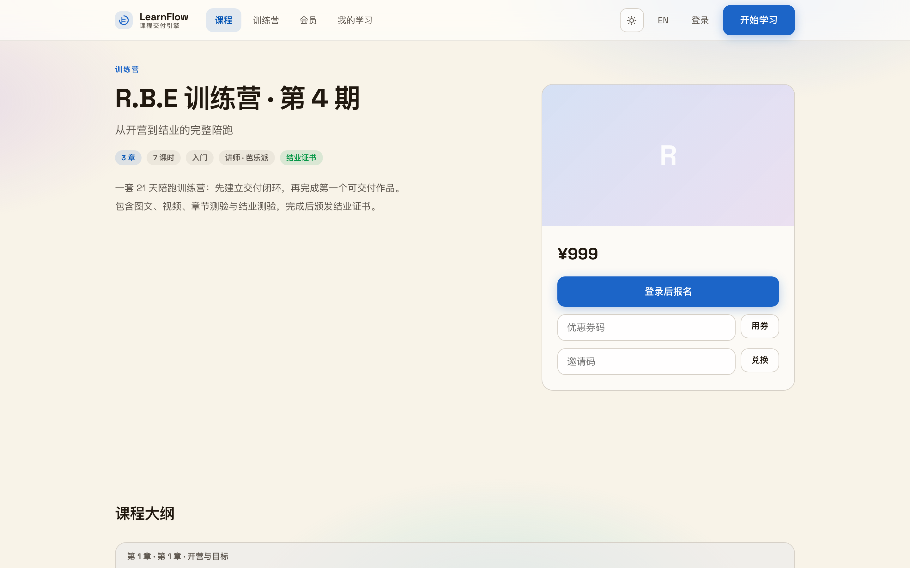
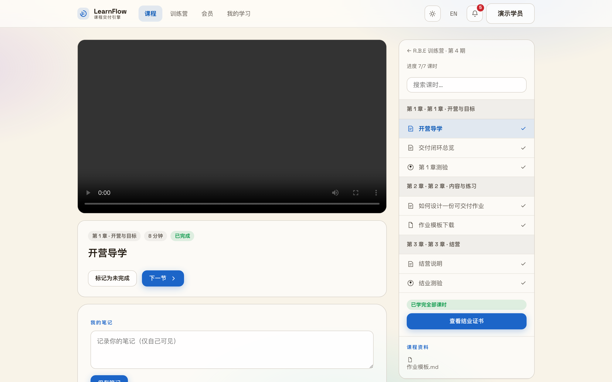
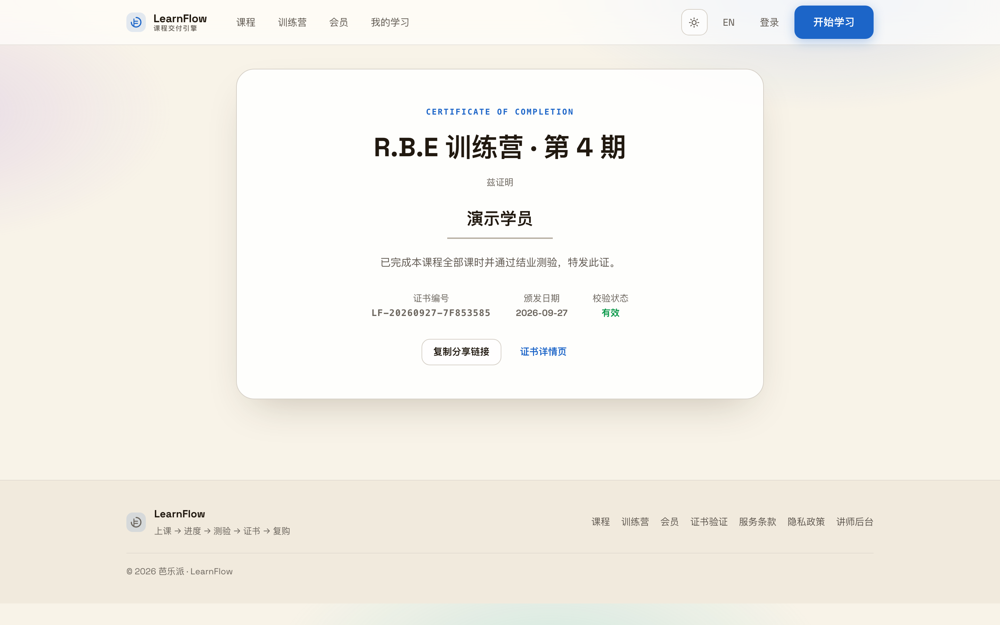
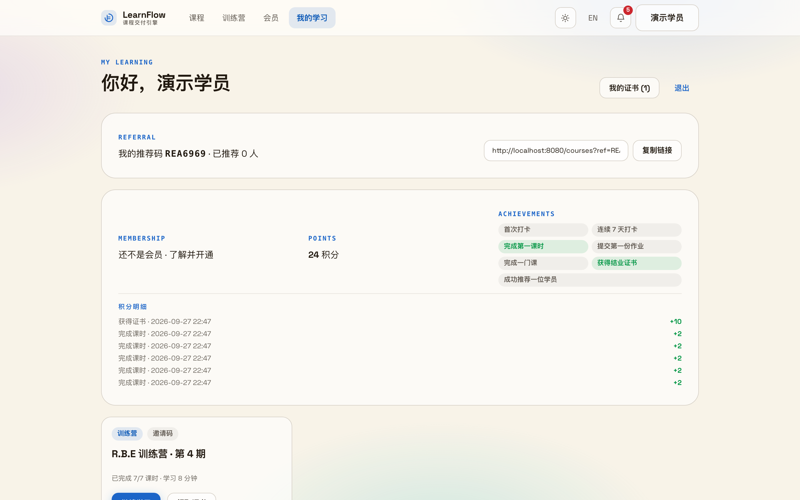
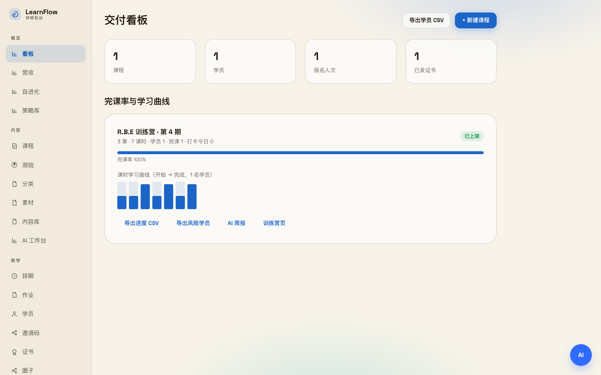

<div align="center">

# LearnFlow —— 讲师与训练营主理人的课程交付单件

**写课、开营、批作业、发证书、看营收，一个后台管完；学员从报名到结业不出这个门。**


[官网](https://nownexts.com) · [使用指南](docs/USAGE-GUIDE.md) · [功能总附录](docs/APPENDIX-FEATURES.md) · [GitHub](https://github.com/sevenaaaaaaaaa/learnflow)

</div>

---

## 这是什么

讲师做线上课，东西总是散的：课程在网课平台、作业在微信群、证书用设计工具一张张手搓、学员数据导不出来。做内容不缺工具，缺的是「卖出去之后」的那一截——学员报名了谁来管？作业谁收？测验谁判？证书谁发？流失了谁知道？

LearnFlow 把这一截做成一个独立小产品。学员侧：报名、看课、做测验、拿证书、交作业、打卡、圈子讨论，一条路走到底。讲师侧：排课、批改、发通知、优惠券、看营收，一个后台做完。轻到什么程度？PHP 8.3 + JSON 文件存储，零框架、零 composer 依赖，一台普通主机就能跑——你不用为它雇运维。

它是产品矩阵里的**进阶层**：先有课要交付，才需要它。单独可用，收款交给 [PayFlow](https://github.com/sevenaaaaaaaaa/payflow)（购买即入学、退款即撤权，已联调），不强依赖任何 CMS 或增长平台；接口全开放，REST `/api/v1` + MCP 共 42 个工具，你的 Agent 可以替你查数据、改课、出题、发通知。训练营运营能力全部来自真实开营（R.B.E 训练营就是自家案例），领域层 154 项回归测试守住每次改动。

讲师的一天，一图看懂：

```
写课（富文本编辑器 / Markdown 导入 / AI 内容工厂）
    ↓ 排课上架（章节课时 · 审批 · 定时发布）
收款 → PayFlow（学员付款，报名自动生效）
    ↓
学员侧（看课 · 测验 · 作业打卡 · 圈子 · 结业证书）
    ↓                                    学习事件 → UserLoop（提醒/召回编排）
讲师侧（批作业 · 发通知 · 优惠券 · 看板）
    ↓
复盘（营收 / 漏斗 / 流失榜）→ 自我体检（每日自检 → 提案 → 护栏内执行）
```

## 核心能力

- **写课快** —— 富文本编辑器 + 素材库，Markdown 直接导入拆课时；AI 内容工厂能从讲义生成课程、从资料出大纲、写朋友圈/社群/直播口播文案，DeepSeek 驱动，带每日额度保险丝。
- **管课稳** —— 章节课时（图文/视频/HLS/直播位）、分类标签、中英双语、课程模板跨课复用；编辑提交→管理员上架，支持定时发布。
- **学员学得下去** —— 播放器断点续播、字幕、自动连播，签名 URL 加防盗水印防下载；章节测验 + 结业测验；学完自动发可分享、可验证真伪的结业证书。
- **训练营跑得动** —— 开营节奏与每日任务、作业提交后讲师/AI 双点评、打卡连续激励、学员圈子（问答/晒进度），还有风险学员名单——谁掉队了，一眼看见。
- **转化有人推** —— 免费课时试看、优惠券、推荐码归因、多级分销佣金记录、会员等级（PayFlow 下单即开通）；站内通知 + SMTP 邮件，文案模板可改。
- **经营看得清** —— 营收、客单价、注册→报名→付费→完课→发证漏斗、课时流失榜、题目正确率，全部 CSV 可导出。
- **Agent 能接班** —— API Key 按只读/写入/AI 三档授权，REST 与 MCP 双入口 42 个工具，出题、批作业、周报都能交给 Agent；系统还会每天自我体检：自检 → 生成改进提案 → 在护栏内自动执行 → 验证效果。

## 真实界面

**① 课程页** —— 学员逛课、报名的地方；课程卡片带类型、课时数与价格。



**② 课程详情** —— 大纲、师资、价格一目了然；支持邀请码入学与优惠码。



**③ 学习页** —— 看课做测验在这一页：播放器、课时目录、进度、笔记、资料下载，右侧一栏全收纳。



**④ 结业证书** —— 学完自动签发，证书编号可公开验证真伪，学员一键分享。



**⑤ 我的学习** —— 学员自己的书架：在学的课、进度、拿到的证书。



**⑥ 讲师后台看板** —— 课程、学员、报名、发证四个数字加完课率曲线，交付情况一眼看清；营收、学员、证书各有专页。



## 具体用例

**用例 A：21 天训练营，从开营到结业。**
① 后台建课选「训练营」，排好 3 章任务与每日打卡；② 生成邀请码 `CAMP4` 发到群里，学员在 `/join` 输码即入学；③ 开营后每天看打卡与作业，AI 先点评一遍你复核；④ 结业测验通过，系统自动发证，你在「证书」页看全名单。

**用例 B：卖一门录播课。**
① 在 LearnFlow 建课传视频，发布上架；② 在 PayFlow 建同名商品，把购买链接挂到课程详情页——学员付款，报名自动生效，退款权益自动撤销；③ 每周看一次漏斗：多少人报名、多少人看完、多少人拿证，课时流失榜告诉你哪一节该重录。

**用例 C：让 Agent 当助教。**
① 后台 → 系统 → API 密钥，建一把 `ai` 作用域的 Key 给你的 Agent；② 它通过 MCP 连 `/mcp` 或直接调 `/api/v1`，用 `ai.generate_quiz` 出题、`ai.grade_assignment` 批作业、`ai.weekly_report` 写周报；③ 所有调用有限流和审计，越权操作直接拒绝。

## 快速开始

```bash
# 依赖：PHP 8.3+（零框架、零 composer 运行时依赖）
git clone https://github.com/sevenaaaaaaaaa/learnflow.git && cd learnflow

php bin/seed.php                        # 生成管理员 / 示例课程 / 学员 / 邀请码
php tests/domain.php                    # 领域层回归：154 项
php -S 127.0.0.1:8080 bin/router.php    # 本地预览
```

- 讲师后台：打开 `http://127.0.0.1:8080/`，登录 `admin / learnflow123`
- 学员端：`http://127.0.0.1:8080/courses`，用演示学员 `demo@learnflow.local / demo123` 体验「学习 → 测验 → 证书」
- 邀请码：`RBECAMP4`（训练营报名用）

上线部署见 [docs/DEPLOY.md](docs/DEPLOY.md)。运维脚本：`php bin/drain.php`（投递互通事件）· `php bin/selfcheck.php`（每日自检）· `php bin/autonomy.php`（护栏内自动执行，默认仅提议）· `php bin/transcode.php`（视频转码，需 ffmpeg）。

目录速览：学员端页面在仓库根（`courses.php` / `course.php` / `learn.php` / `quiz.php` / `camp.php` / `certificate.php` / `dashboard.php`），领域层 `lib/`，接口 `api/`，讲师后台 `admin/`，MCP 入口 `mcp.php`，小程序工程 `miniprogram/`；运行时数据在 `data/`（gitignored，服务器为准）。

线上入口约定（子路径部署）：`nownexts.com/learnflow` = 讲师后台入口；`/learnflow/courses`、`/learn`、`/camp`、`/certificate`、`/dashboard` = 学员端；`/learnflow/api/*` 与 `/learnflow/mcp` = Agent 接口。

## 开源开放

- **核心功能永久开源**，MIT 协议，与 [OpenFlow](https://github.com/sevenaaaaaaaaa/openflow) 一致。课程交付、训练营、证书、看板、Agent 接口——你在这里看到的全部能力，都在开源版里。
- 开发者可以据此收获商业成功，但那属于**定制化开发与服务**，与开源版无关，我们不做功能阉割逼你买商业版。
- **支持矩阵开源生态**：互通只走公开 API 与事件，欢迎把 LearnFlow 接进任何系统——拔掉任何一个，其余照常。
- **支持开发者按需开发插件**：领域层与页面分离、接口全部有文档，欢迎为新课时类型、新交付玩法、新看板贡献插件，完善所有人体验。

## 与 OpenFlow 的关系

LearnFlow 属于进阶层：讲师要的是「交付这一截」，装它一个就够，不强依赖任何 CMS / CDP；全站官网和内容 CMS 归 [OpenFlow](https://github.com/sevenaaaaaaaaa/openflow)，LearnFlow 只管课程交付域。

- 收款 → 交给 PayFlow：购买即入学、退款撤销权益（正向 Webhook + 反向入站事件，已联调）。
- 私域触达 → 学习事件实时投递 UserLoop 的旅程 / Loop 引擎，报名提醒、召回、复购编排由 UserLoop 承载。
- 内容分发 → MFlow 经通用 webhook（HMAC）拿到课程上新等信号。

互通原则（矩阵五个产品一致）：一切互通走公开 API / MCP（Bearer / HMAC），不共享数据库，拔掉任何一个其余照常；任何宣传口径不把其他产品说成本产品的模块。

## 当前边界（诚实声明）

- 分销只做佣金记录 / 归因 / 待结算汇总，不动资金——拼团等资金域交 PayFlow。
- 向量检索需自配 embeddings 服务，未配置自动回退 BM25，功能不中断。
- 视频转码 / 封面需主机装好 ffmpeg（`bin/transcode.php` 就绪即用）；小程序工程已就绪，上架发布需自备微信资质。
- 首个训练营全流程（R.B.E 第 4 期）验证进行中，课程售卖、证书、看板已可用。
- AI 能力（作业点评 / 出题 / 周报 / 内容工厂）需自配 DeepSeek API key（见 `docs/AI-DEEPSEEK.md`），未配置时对应功能不可用，其余功能不受影响。
- 生产建议经 Cloudflare 接入（要点见 `docs/CLOUDFLARE.md`）；`data/` 与 `uploads/` 永不入 git，服务器为准。
- 产品页 / 能力页由主站统一承载（`nownexts.com/product/learnflow`），不在本应用内。

我们区分**已实现 / 已接入 / 已被使用 / 已验证有效**，不把远景写成现状。

## 文档

[使用指南](docs/USAGE-GUIDE.md) · [功能总附录](docs/APPENDIX-FEATURES.md) · [平台总览](docs/PLATFORM.md) · [API 与 MCP](docs/API-MCP.md) · [矩阵互通契约](docs/MATRIX-API.md) · [自进化](docs/EVOLUTION.md) · [部署](docs/DEPLOY.md) · [路线图](docs/ROADMAP.md)

## License

[MIT](https://github.com/sevenaaaaaaaaa/openflow/blob/main/LICENSE) · 由 [芭乐派](https://nownexts.com) 维护 —— 增长方法论与增长社区。
